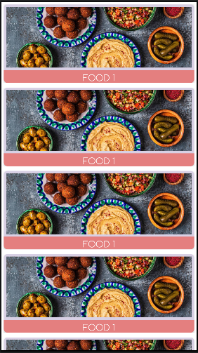

# RecyclerView Implementation

This repository demonstrates the implementation of **RecyclerView** in **Android Studio** using **Java**. The project showcases the usage of **Model** and **Adapter** classes for dynamic data binding and efficient UI rendering.

---

## **What is RecyclerView?**

**RecyclerView** is a flexible and efficient UI component in Android for displaying a large dataset in the form of lists, grids, or custom layouts. It is a more advanced and versatile version of the older **ListView** and **GridView**.

---

## **Why Use RecyclerView?**

- **Efficiency**: RecyclerView reuses views that are no longer visible, improving performance and reducing memory usage.
- **Flexibility**: Supports different layouts like Linear, Grid, and StaggeredGrid.
- **Customizability**: Allows developers to implement custom decorations and animations.
- **Replacement of ListView and GridView**: RecyclerView is modern and highly optimized compared to its predecessors, offering better control and smoother scrolling.

---

## **Project Features**

- **Model Class**: Represents the data structure used to populate the RecyclerView.
- **Adapter Class**: Connects the data (model) with the RecyclerView and inflates the appropriate layout for each item.
- **Dynamic Data Binding**: Demonstrates how to bind data dynamically to the RecyclerView.

---

## **How It Works**

1. **Model Class**: 
   - Contains the data to be displayed in each item of the RecyclerView.

2. **Adapter Class**:
   - Binds the data from the model to the individual views in the RecyclerView.
   - Inflates the layout for each item and handles click events (if implemented).

3. **RecyclerView**:
   - Dynamically displays the data provided by the adapter.

---

## **Setup and Usage**

1. **Clone the Repository**:
   ```bash
   git clone https://github.com/muhammaduthman688/RecyclerView.git

---
## **Contact me**
[](https://wa.me/923472554151) [](mailto:muhammadusman688@gmail.com)

---

## **Screenshots**

### **Main Screen**

